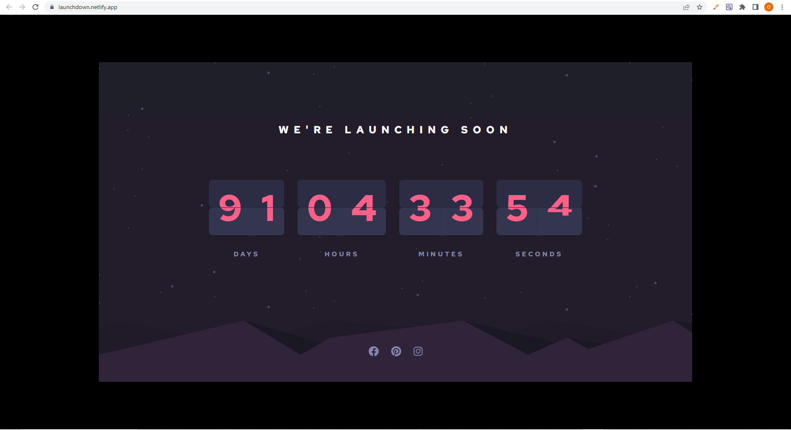

# Frontend Mentor - Launch countdown timer solution

This is a solution to the [Launch countdown timer challenge on Frontend Mentor](https://www.frontendmentor.io/challenges/launch-countdown-timer-N0XkGfyz-). Frontend Mentor challenges help you improve your coding skills by building realistic projects.

## Table of contents

- [Overview](#overview)
  - [The challenge](#the-challenge)
  - [Screenshot](#screenshot)
  - [Links](#links)
  - [Built with](#built-with)
  - [What I learned](#what-i-learned)
  - [Useful resources](#useful-resources)
- [Author](#author)

## Overview

### The challenge

Users should be able to:

- See hover states for all interactive elements on the page
- See a live countdown timer that ticks down every second (start the count at 14 days)
- **Bonus**: When a number changes, make the card flip from the middle

### Screenshot



### Links

- Solution URL: [GitHub Repo](https://github.com/oluwadara5000/countdown)
- Live Site URL: [Live Site Link](https://launchdown.netlify.app/)

## My process

### Built with

- Semantic HTML5 markup
- CSS custom properties
- Flexbox
- CSS Grid
- Vanilla Javascript

### What I learned
```css
@keyframes flip-top {
  100% {
    transform: rotateX(90deg);
  }
}

@keyframes flip-bottom {
  100% {
    transform: rotateX(0deg);
  }
}
```

```js
const countToDate = new Date("July 01, 2023 00:00:00").getTime();
let previousTimeBetweenDates;
setInterval(() => {
  const currentDate = new Date();
  const timeBetweenDates = Math.ceil((countToDate - currentDate) / 1000);
  flipAllCards(timeBetweenDates);

  previousTimeBetweenDates = timeBetweenDates;
}, 250);

function flipAllCards(time) {
  let seconds = time % 60;
  let minutes = Math.floor(time / 60) % 60;
  let hours = Math.floor(time / 3600) % 24;
  let days = Math.floor(time / 86400) % 200;

  flip(document.querySelector("[data-days-tens]"), Math.floor(days / 10));
  flip(document.querySelector("[data-days-ones]"), days % 10);
  flip(document.querySelector("[data-hours-tens]"), Math.floor(hours / 10));
  flip(document.querySelector("[data-hours-ones]"), hours % 10);
  flip(document.querySelector("[data-minutes-tens]"), Math.floor(minutes / 10));
  flip(document.querySelector("[data-minutes-ones]"), minutes % 10);
  flip(document.querySelector("[data-seconds-tens]"), Math.floor(seconds / 10));
  flip(document.querySelector("[data-seconds-ones]"), seconds % 10);
}

topFlip.addEventListener("animationstart", (e) => {
  topHalf.textContent = newNumber;
});

topFlip.addEventListener("animationend", (e) => {
  topFlip.remove();
});

bottomFlip.addEventListener("animationend", (e) => {
  bottomHalf.textContent = newNumber;
  bottomFlip.remove();
});
```

### Useful resources

- [For the CSS Flipping Behaviour](https://www.youtube.com/watch?v=p_6IuhmBsfc) - This helped me to understand the CSS Technique behind the Flipping behaviour and also how to code it.
- [For the Javascript Logic](https://www.youtube.com/watch?v=JvbvnckvIZg) - This is an amazing resource which helped me finally understand how to go about the Javscript logic. I'd recommend it to anyone still learning this concept.

## Author
- Website - [Odejobi Oluwadara](https://github.com/oluwadara5000)
- Frontend Mentor - [@oluwadara5000](https://www.frontendmentor.io/profile/oluwadara5000)
